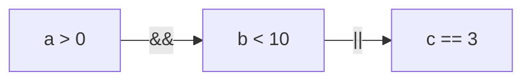

Приоритет операторов и скобки в условиях

## 1. Введение

Давайте начнем с бытовой аналогии. Представьте себе рецепт:

```text
Смешайте муку, яйца и сахар, взбейте, добавьте масло, взбейте еще раз.
```

Выглядит странно? А теперь представьте, что между словами «взбейте» и «добавьте» стоит
запятая или скобки. Порядок действий сразу становится яснее.

В программировании похожая ситуация возникает, когда вы пишете сложное выражение:

```
boolean result = a > 0 && b < 10 || c == 3;
```

Какой порядок? Что вычисляется первым: a > 0 && b < 10, потом || c == 3? Или всё наоборот?
Без четкого порядка вычислений компьютер может «перепутать ингредиенты», и ваш результат
будет неожиданным.

## 2. Приоритет операторов в Java

Java (как и большинство языков программирования) использует определённую таблицу приоритетов.
Операторы с более высоким приоритетом выполняются раньше, чем операторы с низким приоритетом.

Посмотрите на самую важную часть этой таблицы (для условных выражений):

| Оператор       | Описание         | Приоритет     |
| -------------- | ---------------- | ------------- |
| `()`           | Скобки           | самый высокий |
| `!`            | Логическое "НЕ"  | высокий       |
| `==, !=`       | Равно / не равно | средний       |
| `<, >, <=, >=` | Сравнения        | средний       |
| `&&`           | Логическое "И"   | ниже          |
| `\|\|`         | Логическое "ИЛИ" | ещё ниже      |

(Есть ещё арифметические операторы — они выше логических по приоритету.)

#### Главное правило

Операторы "И" (&&) имеют больший приоритет, чем "ИЛИ" (||), то есть сначала будет вычислен
"И", потом "ИЛИ". Недаром И — логическое умножение, а ИЛИ — сложение.

### Блок-схема вычисления приоритета условий



(На практике: a > 0 && b < 10 || c == 3 — сначала считается a > 0 && b < 10, потом
результат сравнивается с c == 3 через ||.)

## 3. Направление операторов: слева направо и наоборот

Кроме приоритета, есть ещё такое слово: ассоциативность. Это правило, в каком направлении
вычисляются операторы, если они стоят «рядом» и имеют один приоритет.

Пример:

```
boolean a = true, b = false, c = true;
boolean result = a && b && c;
```

Вопрос: как посчитается? Ответ: ассоциативность у && — слева направо. Значит, сначала a && b,
потом результат с c.

Применительно к условиям:

| Оператор   | Ассоциативность |
| ---------- | --------------- |
| `&&, \|\|` | слева направо   |
| `!`        | справа налево   |

## 4. Скобки — ваш лучший друг в сложных условиях

Вот здесь начинается магия (и спасение). Когда вы пишете выражение, скобки меняют приоритет
и делают ваш код понятнее и безопаснее.

Пример 1 (без скобок):

```
// Мы хотим: "Если пользователь взрослый и гражданин, или если у него есть спецпропуск"
boolean isAdult = age >= 18;
boolean isCitizen = country.equals("Беларусь");
boolean hasPermit = hasSpecialPass == true;

if (isAdult && isCitizen || hasPermit) {
    System.out.println("Доступ разрешён!");
}
```

Как считает Java:Сначала вычисляет isAdult && isCitizen, потом результат сравнивает по ||
с hasPermit.

* Допустим, isAdult = true, isCitizen = false, hasPermit = true
* isAdult && isCitizen → true && false → false
* false || true → true

То есть, если у человека спецпропуск, всё равно пропустят. А если без спецпропуска,
но взрослый гражданин — тоже пропустят.

Пример 2 (со скобками):

```
if (isAdult && (isCitizen || hasPermit)) {
    System.out.println("Доступ разрешён!");
}
```

Теперь программа сначала проверяет: isCitizen || hasPermit, а затем этот результат вместе
с isAdult.

То есть вам нужно быть взрослым и (или гражданином, или иметь спецпропуск). Маленькая разница
в скобках — огромная разница в логике!
